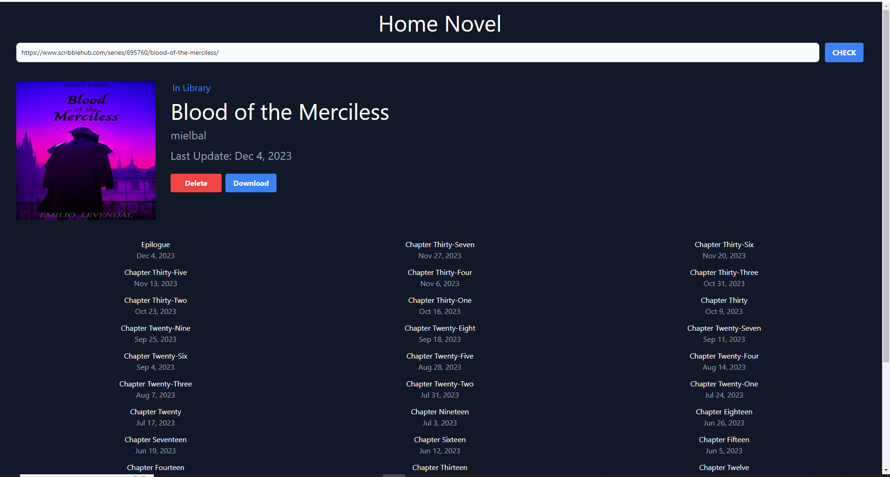

<a name="readme-top"></a>

# 📗 Table of Contents

- [📗 Table of Contents](#-table-of-contents)
- [📖 Home-Nove](#-Home-Nove-)
  - [🛠 Built With ](#-built-with-)
    - [Tech Stack ](#tech-stack-)
    - [Key Features ](#key-features-)
  - [💻 Getting Started ](#-getting-started-)
    - [Prerequisites](#prerequisites)
    - [Setup](#setup)
    - [Install](#install)
    - [Usage ](#usage-)
    - [Deployment](#deployment)
  - [👥 Author ](#-author-)
  - [🔭 Future Features ](#-future-features-)
  - [🤝 Contributing ](#-contributing-)
  - [⭐️ Show your support ](#️-show-your-support-)
  - [📝 License ](#-license-)

<!-- PROJECT DESCRIPTION -->

# 📖 Home-Novel <a name="about-the-project"></a>

<div align="center">

<div>

A desktop App scrapper built with Electron and NextJs, utilizing Puppeteer to
scrape stories from ScribbleHub website and download it as PDF (still in
development).

## 🛠 Built With <a name="built-with"></a>

### Tech Stack <a name="tech-stack"></a>

<details>
  <summary>Client</summary>
  <ul>
    <li><a href="https://www.electronjs.org/">ElectronJS</a></li>
    <li><a href="https://tailwindcss.com/">TailwindCSS</a></li>
  </ul>
</details>
<details>
  <summary>Server</summary>
  <ul>
    <li><a href="https://nextjs.org/">NextJS</a></li>
  </ul>
</details>

<details>
<summary>Database</summary>
  <ul>
    <li><a href="https://www.sqlite.org/">SQLite</a></li>
  </ul>
</details>

<!-- Features -->

### Key Features <a name="key-features"></a>

- Use Puppeteer to scrape websites.
- Save stories in Sqlite Database.
- Download stories in PDF Format

<p align="right">(<a href="#readme-top">back to top</a>)</p>

<!-- GETTING STARTED -->

## 💻 Getting Started <a name="getting-started"></a>

### Prerequisites

In order to run this project you need:

- [NodeJS](https://rubyonrails.org/) installed and running. To get more
  information, read the [installation guide](https://nodejs.org/en/docs).

### Setup

Clone this repository to your desired folder:

```
  git clone https://github.com/AmineDerbal/home-Novel-nextron-V2.git
  cd home-Novel-nextron-V2
```

### Install

Install thr project dependencies with:

```
  npm install
```

### Usage <a name="usage"></a>

To run the project, execute the following command:

```
  npm run dev
```

### Deployment

You can deploy this project using:

```
  N/A
```

<p align="right">(<a href="#readme-top">back to top</a>)</p>

<!-- AUTHORS -->

## 👥 Authors <a name="authors"></a>

👤 **Derbal Mohammed El Amine**

- GitHub: [@githubhandle](https://github.com/AmineDerbal)
- LinkedIn:
  [LinkedIn](https://www.linkedin.com/in/mohammed-el-amine-derbal-4038541b6/)

<p align="right">(<a href="#readme-top">back to top</a>)</p>

<!-- FUTURE FEATURES -->

## 🔭 Future Features <a name="future-features"></a>

- Add Library page
- Add library update feature

<p align="right">(<a href="#readme-top">back to top</a>)</p>

<!-- CONTRIBUTING -->

## 🤝 Contributing <a name="contributing"></a>

Contributions, issues, and feature requests are welcome!

Feel free to check the
[issues page](https://github.com/AmineDerbal/home-Novel-nextron-V2/issues).

<p align="right">(<a href="#readme-top">back to top</a>)</p>

<!-- SUPPORT -->

## ⭐️ Show your support <a name="support"></a>

If you like this project and want to support me make cooler projects Give this
project a Star.

<p align="right">(<a href="#readme-top">back to top</a>)</p>

<!-- LICENSE -->

## 📝 License <a name="license"></a>

This project is [MIT](./LICENCE) licensed.

<p align="right">(<a href="#readme-top">back to top</a>)</p>
